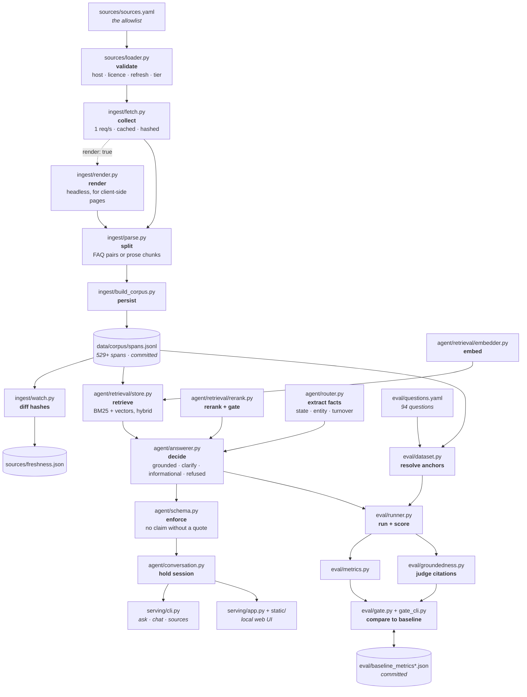

# founder-desk

Grounded answers to the compliance questions a new Indian company hits in its
first year — GST, provident fund, DPIIT recognition, incorporation — where
**every claim is a verbatim quote from a primary government source**, stamped
with the URL and the date it was fetched.

When the sources cannot answer, it says so and lists what it searched. It never
writes a plausible sentence to fill the gap.

> **Information grounded in primary sources — not professional advice.** Quotes
> are reproduced from official government publications and may have been amended
> since they were fetched. Nothing here replaces a qualified chartered
> accountant, company secretary or lawyer.

---

## The problem

The authoritative text exists, is free, and is unusable. A founder's first year
touches MCA, CBIC, CBDT, DPIIT, EPFO, ESIC and a state government at once, in
statute, notification and FAQ form, across a dozen portals with no common
search. What ranks on Google instead is professional-firm content marketing:
undated, uncited, and often stale by one or more amendments.

So the gap is not "a chatbot that knows about GST". It is **a system that refuses
to answer without quoting a primary source, and knows when its source went out of
date.** Both halves are load-bearing, and both are enforced in code rather than
requested in a prompt.

## What an answer looks like

```
$ founder-desk ask "can a one person company get startup india benefits"

Q: can a one person company get startup india benefits
   [entity: opc · state: all-India]

  Yes. One Person Companies are eligible to avail benefits under the Startup
  India initiative.

  sources
    Startup India Frequently Asked Questions - Q: Would a One Person Company
    (OPC) be eligible to avail benefits under the Startup India initiative?
      DPIIT / Startup India · official guidance · fetched 2026-09-03
      https://www.startupindia.gov.in/content/sih/en/about_us/faqs.html
```

And when it cannot:

```
$ founder-desk ask "by when must I file INC-20A"

  I cannot ground an answer to this in the allowlisted sources, so I am not
  going to guess. This is either outside what this tool covers, or in a domain
  whose sources could not be collected - see the coverage table below.

  searched 13 official sources: ...
```

That second one is the interesting case. INC-20A is exactly the kind of question
this project exists for, and the corpus is full of confident, correctly-cited
spans about *other* filing deadlines. Answering from one of them would produce a
wrong answer that looks perfectly sourced.

---

## Four outcomes, and only one is an answer

| outcome | when | what it returns |
|---|---|---|
| `grounded` | the corpus covers it | claims, each quoting a cited span |
| `clarify` | the topic is state law and no state was given | the specific question needed |
| `informational_only` | it asks for a recommendation | the factors, and who should decide |
| `refused` | nothing supports an answer | what was searched, and nothing else |

The checks that rule out an answer run **before** retrieval, deliberately. Once a
plausible span is on screen the temptation is to use it.

*Clarify* exists because state law is the most common way to be confidently
wrong here — Shops & Establishments, professional tax and stamp duty all differ
by state. The router will not infer a state from a city, because a registered
office can sit in a different state from the operation:

```
$ founder-desk ask "do I need shops and establishment registration in Mumbai"

  This depends on your state - the rules you are asking about are state law.
  You mentioned Mumbai, but a company's registered office can sit in a
  different state from where it operates, so I will not assume. Which state is
  the registered office in?
```

---

## What you can ask it

The corpus covers the first year: GST, provident fund and contract labour,
DPIIT recognition, and incorporation. Below is what actually works today, with
the real answer each returns.

**GST — registration, thresholds and returns** (320 spans, the deepest area)

```bash
founder-desk ask "do traders under 20 lakh turnover need GST registration"
founder-desk ask "I take on projects in several states - do I need a GST number in each"
founder-desk ask "if I register voluntarily under 20 lakh, do I pay tax from my first sale"
founder-desk ask "can I hold two GST registrations on one PAN"
founder-desk ask "I provide services and turn over 50 lakh - can I opt for composition"
founder-desk ask "we deal only in exempt goods but are registered - do we file returns"
```

**Provident fund and contract labour** (141 spans)

```bash
founder-desk ask "if someone's basic plus DA is above 15000, must they join EPF"
founder-desk ask "can I recover the employer's PF share from my employee's salary"
founder-desk ask "does an apprentice have to be enrolled in provident fund"
founder-desk ask "at how many contract workers must my establishment register"
founder-desk ask "what happens if a principal employer never registers for contract labour"
```

**DPIIT / Startup India recognition** (35 spans)

```bash
founder-desk ask "can a one person company get startup india benefits"
founder-desk ask "which papers do I upload to get DPIIT recognised"
founder-desk ask "how long does the recognition certificate take"
founder-desk ask "can a foreign national be an LLP partner and still register with startup india"
```

**Incorporation** (1 span — see the coverage table)

```bash
founder-desk ask "which kinds of company can I set up in India"
```

### And what it does instead of answering

Three of the four outcomes are not answers, and they are the point.

```bash
# Asks, because this is state law and no state was given
founder-desk ask "do I need shops and establishment registration in Mumbai"

# Gives factors and names who should decide - never a recommendation
founder-desk ask "should I register an LLP or a Pvt Ltd"

# Refuses: in scope, but the source is uncollectable
founder-desk ask "by when must I file INC-20A"

# Refuses: outside what this covers
founder-desk ask "how do I get an FSSAI licence for a food business"
founder-desk ask "who won the cricket world cup"
```

Every example above was run before being written down, and behaves as shown.

**Refusal is still the weakest behaviour**, though much less so than it was: at
0.654 it is the lowest number in the evaluation. What remains is a specific,
nameable class — questions that are squarely about a topic the corpus covers,
asking something inside it that the corpus does not contain. "How many people
must be on the board of a private company" is about incorporation, and the one
incorporation span *is* about companies; it simply says nothing about boards. No
relevance score separates those, because the span genuinely is relevant. Telling
them apart is question-answering, not retrieval.

Add `--state MH` (any ISO 3166-2:IN code) or `--entity pvt-ltd|llp|opc|sole-prop`
to answer for a specific situation, and `founder-desk sources` to see every
source it is allowed to read.

---

## What AI is in the backend?

**None, by default.** No language model is called, no API key is needed, and
nothing leaves your machine except the requests that fetch the government pages
themselves. The only outbound calls anywhere in the package are in
`ingest/fetch.py`.

| stage | what actually runs |
|---|---|
| lexical retrieval | **BM25** — a ranking function from 1994. Arithmetic over term frequencies. |
| semantic retrieval | **`BAAI/bge-small-en-v1.5`** when the extra is installed, otherwise character n-gram hashing. Local, offline, no key. Finds spans; writes nothing. |
| answering | **Extractive.** The answer *is* the source's sentences, returned verbatim. There is no generation step. |
| reranking *(optional)* | **`BAAI/bge-reranker-base`**, a local cross-encoder. Runs on your CPU, only *reorders* candidates, and gates refusals — it never writes text. |

The two models are both *encoders*: they score and rank text, they do not
generate it. That is a design choice, not a limitation waiting to be fixed. Fabrication is
impossible here by construction rather than by prompt: there is no step at which
a sentence could acquire a fact the corpus does not contain. It also means the
whole evaluation runs for `$0.0000` with no key, which is why the CI gate can
afford to check every pull request.

`agent/llm.py` defines a `StructuredModel` protocol for optionally synthesising
several quotes into connected prose. It is **imported by nothing** — not the
answerer, not the evaluation, not the service — and has never been run against a
live model. If it is ever wired up, the groundedness judge and its zero-tolerance
fabrication gate are already in place to police it.

---

## How "vetted by official sources only" is enforced

Not by a ranking preference. By a validator.

[`sources/sources.yaml`](sources/sources.yaml) is the only path into the index,
and [`sources/loader.py`](sources/loader.py) rejects any entry that is not
published on an official government host, or that omits a licence, or that omits
a refresh window. A CA firm's blog cannot be added to this project even by
someone who wants to — the loader raises.

```python
SourceEntry(url="https://example-ca-firm.com/gst-guide", ...)
# ValueError: 'example-ca-firm.com' is not an official government host.
# Allowed suffixes: .gov.in, .nic.in, rbi.org.in. Commentary, news and
# professional-firm content are out of scope by design.
```

Sources carry an **authority tier**, because the difference matters and the
system should be auditable on it:

| tier | what it is | in this corpus |
|---|---|---|
| 1 | statute and rules | 27 spans |
| 2 | notifications, circulars, RBI master directions | 1 span |
| 3 | official guidance — portal FAQs, department help pages | 468 spans |

The tier-3 skew is honest and is the single biggest weakness of the current
corpus: departmental FAQs are what these portals actually publish as HTML, while
the Acts and Rules sit behind PDFs and blocked hosts.

It got *worse*, deliberately, when the fragment and contents-page filters landed:
tier-1 spans fell from 70 to 27. The chunks removed were real statute text and
correctly cited, but they opened mid-sentence or were pure section-number lists,
and quoting one next to a clean answer makes the good quote look less
trustworthy rather than the fragment more so. Fewer, readable statute spans is
the right trade at this corpus size; properly parsing the Act into sections is
the fix, and it has not been done.

**Licences are declared, not assumed.** Every entry names the terms it is reused
under and carries `license_verified: false` until a human has actually read that
portal's terms. None have been read yet, and the field says so rather than
implying diligence that has not happened.

---

## Roadmap — product phases

What a founder would notice, ordered by who it helps rather than by difficulty.
Each phase is shippable alone. The engineering view of the same work is in
[Roadmap — engineering phases](#roadmap--engineering-phases).

| # | Phase | Why a founder needs it | Done when |
|---|---|---|---|
| ✅ | **Sourced answers, or an honest refusal** | Search returns undated, uncited firm content | Every claim quotes a source with a date, or refuses |
| ✅ | **Company setup: entity types, DIN, PAN, bank account** | The first questions anyone asks, and the ones it used to refuse | Entity types, DIN, PAN and account-opening documents answer with citations |
| 🔶 | **The states founders register in** | Shop registration, professional tax and stamp duty are state law | Per state: is registration required, by when, hours rules, professional tax |
| ⬜ | **"What am I supposed to be doing?"** | The real failure is the question nobody knew to ask; penalties follow | A profile produces a dated task list, every item citing its rule |
| ⬜ | **Tell me when the rules change** | An answer right in March can be wrong in April | A weekly digest has caught one real amendment end to end |
| ⬜ | **Answer in the founder's language** | State law is published in-language first, English late or never | A Marathi question returns a Marathi answer from Marathi source text |
| ⬜ | **Clear it for other people to use** | The first question anyone asks of a public tool | Every source carries a checked licence, not an assumed one |

**Phase 2 is partial:** Delhi, Haryana and Telangana are covered. Karnataka and
Maharashtra are not, and the reasons are mechanical rather than editorial — see
[What could not be collected, and why](#what-could-not-be-collected-and-why).

**Phase 3 depends on 1 and 2.** A first-year checklist is only as trustworthy as
the coverage beneath it, and one that silently omits company setup is worse than
none at all.

## Roadmap — engineering phases

The same work seen from the code. Where a product phase says *what a founder can
ask*, this says *what capability the system gains* — and every open one is gated
by a missing capability rather than by effort.

| # | Capability | Product phase it serves | State |
|---|---|---|---|
| E1 | Allowlist with host, licence and refresh validation | all | ✅ |
| E2 | Cached, rate-limited ingestion; content-hash freshness ledger | all | ✅ |
| E3 | Hybrid BM25 + vector retrieval, in-memory, 0.38 ms p50 | all | ✅ |
| E4 | Four-outcome answer contract with grounding enforced by validator | all | ✅ |
| E5 | Evaluation harness and two committed CI baselines | all | ✅ |
| E6 | Headless rendering for client-side portals | company setup | ✅ |
| E7 | Cross-encoder relevance gate for refusals | all | ✅ |
| E8 | Embedding model behind the same protocol | all | ✅ |
| E9 | Jurisdiction scoping + stratified retrieval by state | states | ✅ |
| E10 | Tier-4 external sources, declared and surfaced | PAN | ✅ |
| E11 | **PDF text extraction in ingestion** | statute depth | ⬜ born-digital only; `pypdf` already a dependency |
| E12 | **OCR** | Karnataka | ⬜ its Shops Act is scanned images |
| E13 | **Legacy-font transcoding** | Maharashtra | ⬜ its Rules are non-Unicode Marathi |
| E14 | **Multilingual embedder and reranker** | in-language answers | ⬜ current pair is English-only |
| E15 | **Structured entity/deadline model** | the checklist | ⬜ needs facts, not spans |

E11 is the cheapest and unlocks the most: most Indian statute is published as
PDF, which is why the corpus is 86% departmental guidance rather than law.

## Evaluation criteria

What "working" means, and what each number is accountable for. All of it runs on
94 questions in [`eval/questions.yaml`](eval/questions.yaml) at `$0.0000`.

| Criterion | Measures | Gate |
|---|---|---|
| **recall@1 / recall@5** | Is the right span retrieved at all? The ceiling on everything after it | 0.02 absolute, downward |
| **MRR** | Where it lands — catches quality sliding from rank 1 to rank 5 | 0.02 absolute, downward |
| **Routing accuracy** | Did it pick the right *kind* of response, not just a good span | 0.02 absolute, downward |
| **Refusal accuracy** | Does it decline what the corpus cannot answer | 0.02 absolute, downward |
| **Over-refusal** | Answerable questions wrongly refused | 0.05, **upward** |
| **Fabricated citations** | Authority that was never retrieved | **zero tolerance** |
| **Unofficial citations** | A source not on the allowlist | **zero tolerance** |
| **External citation rate** | Reliance on declared tier-4 sources | 0.02, **upward** |
| **Citation faithfulness** | Catches a corpus rotting in place while retrieval looks fine | 0.02 absolute, downward |
| **Cost per answer** | Buying accuracy with spend should be a decision | 25% ratio |

Three of these are deliberately inverted, and each guards a way of gaming the
rest: refuse everything and refusal accuracy hits 1.000; lean on easier
non-government sources and coverage looks better; let the corpus go stale and
retrieval numbers never move while every citation quietly stops being vouched
for.

**Reading the set honestly.** 94 questions is small — three misses move
recall@5 by a point. The refusal half is deliberately adversarial: 14 of the 27
are rephrasings that defeated an earlier gate, or questions inside a covered
topic the corpus does not answer. Every answerable question is a hand-written
paraphrase, never the source's own wording, and a test enforces that.

## The corpus

689 spans, 393,865 characters, from 24 of 41 allowlisted sources.

| domain | spans | note |
|---|---|---|
| gst | 320 | CBIC FAQs + GST portal help |
| labour | 276 | EPF & MP Act 1952, EPFO FAQs, ESI Acts, contract labour, **Delhi · Haryana · Telangana** |
| banking_fema | 44 | RBI Commercial Banks KYC Directions — what a bank must obtain to open an account |
| startup_india | 32 | DPIIT recognition, self-certification |
| tax_registration | 17 | Income Tax guidance for business and professional income |
| incorporation | 2 | NSWS / Ministry of Corporate Affairs — entity types and DIN. **Still thin** |

### What could not be collected, and why

This is the part most likely to be quietly omitted, so it is stated first.

| source | reason |
|---|---|
| MCA portal | HTTP 403 to any non-browser client |
| India Code (Companies Act 2013) | HTTP 403 to any non-browser client |
| Ministry of Labour | HTTP 403 to any non-browser client |
| NSWS full listing | renders, but the catalogue is a paginated React UI — enumerable with `ingest/discover_nsws.py` |
| NSWS startup registration | renders, and is **empty upstream**: no "About this approval" text |
| Karnataka Shops Act + Rules | scanned PDFs, no text layer — 65 pages yield 64 characters. Needs OCR |
| Maharashtra Shops Rules 2018 | text layer is legacy-font Marathi, extracts as mojibake |

A browser User-Agent is not spoofed for the three that return 403. These are
public services that have said no in the way a service says no, and a test pins
that they are never routed through the renderer either.

**Three states covered: Delhi, Haryana and Telangana.** Telangana's labour
department publishes ~46k characters of English Q&A and Haryana the Punjab Shops
Act as applied there, so both reach the standard Delhi set. The clarifying
question now names the states it can actually use, rather than asking for a fact
it may not be able to act on.

**Karnataka and Maharashtra remain out, and not for want of trying.** Karnataka and
Maharashtra were searched properly and neither can be collected to the standard
Delhi met — for mechanical reasons, each naming a different missing capability:
Karnataka publishes its Shops Act only as scanned images (OCR), Maharashtra
publishes its Rules in a legacy non-Unicode Marathi font (transcoding, and then
an Indic-capable embedder). The state portals' own HTML is either 82% Devanagari
or a thin forms menu — the shape already measured harmful. All three are listed
with their reasons rather than quietly omitted.

**Incorporation is now covered, thinly.** One span, from the official Ministry
of Corporate Affairs page on NSWS: which entity types can be incorporated, the
governing Companies Act, and the stated processing time. That is enough to
answer "which kinds of company can I set up in India" and nowhere near enough for
SPICe+, INC-20A, AOC-4 or director requirements — all of which the system still
refuses.

### Headless rendering, and the line it does not cross

Some official portals build their pages in the browser. NSWS returns 29
characters of server HTML and assembles everything client-side, so a static
fetcher sees an empty shell however many times it asks — the same reason it would
be unreachable to a reader without JavaScript.

`ingest/render.py` drives headless Chromium for sources marked `render: true`,
at the same one-request-per-second rate and **with the same honest identifying
User-Agent as the plain fetcher**. What changes is only that the page's own
JavaScript runs. A site that declines to serve us still declines: the three hosts
returning 403 are not routed through the renderer, because using a browser to get
past a refusal is working around a "no" rather than reading a page written for a
browser.

Each rendered source names a `content_selector`. Taking the whole `<body>` wraps
every span in the site's header and footer — helpdesk number, ministry
navigation, translation notice, copyright — and repeated across a corpus that
boilerplate becomes common vocabulary, dragging on BM25 and diluting the quote a
reader sees. A selector that stops matching returns nothing and logs it, rather
than silently refilling the corpus with chrome.

The browser is an optional extra (`pip install -e ".[browser]" && playwright
install chromium`). The committed corpus means CI never needs it, and a missing
browser is reported per source with the command that fixes it rather than
failing the run.

NSWS's internal JSON API was found and not used: it returns HTTP 400 to a plain
request, and reverse-engineering an undocumented internal endpoint is a worse
citizen than rendering the page the portal actually offers the public.

### ESIC: fixed properly rather than worked around

ESIC was in the blocked list too. Its server sends only its leaf certificate and
omits the intermediate, so the chain cannot be built from a normal trust store.

Disabling certificate verification would have collected it in one line, and is
refused: a tampered response would then be indistinguishable from a real one,
which is an unacceptable trade for text this system quotes as law. Instead the
missing GlobalSign intermediate is committed under `sources/certs/` and supplied
explicitly. Validation still terminates at *GlobalSign Root CA - R6*, already in
certifi — a link was added to the chain, not removed from it.

Tests pin the certificate's SHA-256 fingerprint, assert it is an intermediate
rather than self-signed (a self-signed pin would be trust-on-first-use, not
verification), fail 90 days before it expires so rotation is scheduled rather
than discovered, and walk the AST of every ingest module to prove `verify=False`
appears nowhere.

### Collection etiquette

One request per second, serialised; an honest User-Agent naming the project and
a contact address; cached and resumable, so re-runs cost the source nothing.

```bash
python -m ingest.build_corpus     # fetch, parse, persist (cached; ~15s cold)
python -m ingest.watch            # re-fetch and diff against the corpus
```

---

## Freshness is tracked, not assumed

Indian compliance rarely breaks because a system invented law. It breaks because
a notification amended the position and the answer kept quoting the old one,
confidently and with a real citation.

Every span carries the instrument's date, the fetch date, and a hash of the
source's readable text. `ingest/watch.py` re-fetches and diffs those hashes;
changed sources mark their spans `needs_review`, and spans past their source's
refresh window go `stale` and are flagged in the answer. A weekly CI job runs it.

The hash is taken over *extracted text with whitespace normalised*, not raw
bytes — government portals stamp build ids and session tokens into their markup,
so a byte hash would report a change on every fetch and the signal would be
noise.

---

## Retrieval

Hybrid BM25 + vector over an in-memory matrix, then optional cross-encoder
reranking.

**Why hybrid is not a refinement here.** Compliance questions turn on exact
tokens — a form number (`INC-20A`), a section reference (`Section 2(6)`), a
threshold (`20 lakh`). A dense embedding blurs precisely those. Conversely BM25
cannot see that "do I need to register" and "is registration required" are the
same question. Each half covers the other's failure.

**Why there is no vector database.** Measured on this corpus:

| | |
|---|---|
| spans | 541 |
| vector matrix | 1.1 MB at 512 dims |
| index build | 0.31 s |
| exact search, p50 / p95 | **0.38 ms / 0.49 ms** |

A round trip to any hosted vector store is 20–50 ms of network before it does
any work, and an HNSW index would be approximate where this is exact. It would
cost money and latency for worse recall.

### Does the embedding model earn its place?

The semantic half of retrieval can be character n-gram hashing (free, offline,
semantically blind) or a real embedding model — `BAAI/bge-small-en-v1.5`, local,
needing no new dependency because `sentence-transformers` is already installed
for the cross-encoder. `python -m eval.runner --compare-embedder`, 87 questions:

| | recall@1 | recall@5 | MRR | routing | added startup |
|---|---|---|---|---|---|
| hashing + no reranker | 0.596 | 0.830 | 0.698 | 0.713 | — |
| model + no reranker | **0.681** | 0.894 | 0.760 | 0.678 | +5.7 s |
| hashing + cross-encoder | 0.681 | 0.894 | 0.764 | **0.885** | +7.9 s |
| **model + cross-encoder** | 0.681 | **0.936** | **0.780** | **0.885** | +13.6 s |

**The interesting result is the row that does not move.** On its own the model is
a large win — recall@1 0.596 → 0.681, and it bridges paraphrases hashing cannot
("how long can my staff work in a day" against "what are the working hours for
employees"). But once the cross-encoder is in front of it, recall@1 is *identical*
either way: the cross-encoder was already recovering what the weak embedder
missed, because BM25 got the right span into the 20-candidate pool often enough
for reranking to find it. What remains is recall@5 +0.042 and MRR +0.016, with
routing accuracy unchanged to three decimals.

So it ships as the default when installed — there is no regression and 0.936 is
the best measured recall@5 — but it is a much smaller win than it looks like in
isolation, and it costs about six seconds of startup. `--embedder hashing` turns
it off. This is the same test the reranker had to pass; the reranker passed it
more convincingly.

There is still no generative model anywhere. This changes which spans are
*found*, never what is said about them.

### Fixing the refusal gate

The gate originally measured IDF-weighted vocabulary overlap, and a rephrasing
could defeat it: *"How much does it cost to register a trademark for a logo in
India?"* refused correctly while *"how much does it cost to trademark a logo in
India"* returned a definition of a term sheet — a real quote, correctly cited,
and no answer to the question.

Two things were needed to fix it, and the first mattered more.

**The refusal set was too easy.** Twelve mostly-obvious out-of-scope questions
scored 0.667, which flattered the gate. Adding fourteen adversarial cases — every
rephrasing known to defeat it, plus in-scope-but-uncovered questions like AOC-4
penalties and minimum paid-up capital — put the true number at **0.385**. The
first result of the work was the metric getting worse, because it started being
honest.

**Then: no lexical signal fixes it.** Raw BM25, a discriminative-term match, and
a joint grid search over three parameters were all measured. The best lexical
rule scored 0.714 overall against the incumbent's 0.686, and bought it by
trading answering ability away (grounded 0.864 → 0.705). That is not a fix; it
is moving the failure. Vocabulary overlap and topical relevance are different
quantities, and no threshold on the first recovers the second.

**A cross-encoder does fix it, because it measures the right thing.** It scores
the question and the span jointly, producing an absolute answer to "is this span
about what was asked":

| gate | grounded | refused | over-refusal | overall |
|---|---|---|---|---|
| coverage (lexical) | 0.864 | 0.385 | 0.136 | 0.732 |
| **cross-encoder @ 0.05** | **0.977** | **0.654** | **0.023** | **0.878** |

It improves *both* directions at once, which is what distinguishes a fix from a
threshold move. The score costs nothing extra — it is the reranker's own output,
already computed for ordering — so when the extra is installed, better refusals
are free.

### Does the cross-encoder earn its place?

`python -m eval.runner --compare-rerank`, same 82 questions:

| | recall@1 | recall@5 | MRR | latency |
|---|---|---|---|---|
| hybrid only | 0.636 | 0.864 | 0.734 | 0.38 ms |
| + cross-encoder | **0.727** | **0.932** | **0.805** | 665 ms |

`BAAI/bge-reranker-base`, CPU. It buys about 9 points of recall@1 for roughly
1,750× the retrieval latency, plus a 2 GB dependency and a 13-second model load.

On ranking alone that trade would be arguable. It is not arguable once the same
score is doing the refusal gating above, which is why **the cross-encoder is now
the default when installed** and the CLI prints a warning when it is not. It
stays an optional extra because 2 GB is a real imposition for someone who only
wants to read the code — but an install without it is a measurably weaker
system, and the README, the CLI and the second CI baseline all say so rather
than letting the difference pass unnoticed.

Getting this comparison to be *meaningful* required a fix worth describing. When
the refusal gate read the reranked list while still scoring it lexically, the
cross-encoder improved retrieval and made routing **worse**: it promotes spans
that are semantically apt but share fewer words with the question, so they won
the ranking and then failed a lexical gate. Retrieval quality and answerability
are separate questions, and the gate had been reading the ranking as if it
answered both. Once separated, the reranker's score could be used for what it is
actually good at — which is how it ended up being the refusal gate.

---

## Evaluation

92 questions in [`eval/questions.yaml`](eval/questions.yaml): 53 answerable, 27
that must be refused, 7 that must ask for a state, 5 that must decline to
recommend.

The refusal half is deliberately adversarial. Fourteen of the twenty-six are
rephrasings that defeated an earlier version of the gate, or questions inside a
covered topic that the corpus does not actually answer. A refusal set of obvious
nonsense measures nothing.

Every answerable question is a **paraphrase**, never the source's own wording.
The corpus is built from FAQ pages, so the lazy version — copy each source
question and label it with its own span — would measure string matching and
report near 1.00. A test enforces this ([`test_questions_are_paraphrases_not_copies`](tests/test_eval_dataset.py)),
and it caught one verbatim question in this very file.

Gold labels reference **a phrase from the source question**, not a span id, and
resolve at load time. Ambiguous or missing anchors are a hard error.

### Results

Two systems are measured and both baselines are committed, because the project
ships two refusal gates. `$0.0000` per answer either way — neither calls an API.

| | lexical gate | **cross-encoder gate** (default when installed) |
|---|---|---|
| recall@1 (n=53) | 0.528 | **0.698** |
| recall@5 | 0.774 | **0.906** |
| MRR | 0.643 | **0.783** |
| routing overall (n=92) | 0.717 | **0.859** |
| grounded | 0.774 | **0.962** |
| clarify | 1.000 | 1.000 |
| informational_only | 1.000 | 1.000 |
| refused | 0.333 | **0.593** |
| over-refusal | 0.151 | **0.038** |

| citation faithfulness | |
|---|---|
| faithful | 1.000 |
| **fabricated** | **0.000** |
| **unofficial** | **0.000** |

Fabrication is zero *by construction*, not by luck: the default answerer is
extractive, so a claim's text is the source's own words and there is no
generation step in which a sentence could acquire a fact the corpus does not
contain. The check exists anyway, because it must still hold the day a
model-backed answerer is added — a gate written after the risk appears is a gate
written too late.

### Reading these numbers honestly

- **87 questions is small.** Recall@5 of 0.894 means five misses. Treat the
  third decimal as noise.
- **Refusal accuracy is 0.679, still the weakest number here**, and it is
  reported next to over-refusal on purpose: refusing everything would score
  1.000 on one and destroy the other. The nine questions wrongly answered are
  almost all in-scope-but-uncovered — board size, paid-up capital, name
  reservation — where the retrieved span is genuinely relevant and simply does
  not contain the answer.
- **Routing accuracy is not answer correctness.** It measures whether the system
  chose the right *kind* of response and retrieved the right span — not whether
  a reader would be well served by the quote.
- **The corpus is 94% tier-3 guidance.** These numbers describe finding the
  right FAQ entry, which is a lower bar than reading the Act.

### Both thresholds were swept, not chosen

`python -m eval.runner --sweep`. Overall accuracy peaks at 0.846 across a plateau
from 0.22 to 0.28, and the choice within it is a judgement about which error is
worse:

| threshold | grounded | refused | over-refusal |
|---|---|---|---|
| 0.22 | 0.976 | 0.250 | 0.024 |
| **0.28** | 0.878 | **0.583** | 0.122 |

0.28 is chosen: at 0.22 the system answers three-quarters of what it should
refuse, and those are the dangerous ones. A wrong refusal costs a rephrase; a
wrong answer about a filing deadline costs a penalty.

### Three measurements that overturned the obvious approach

**The normalised score cannot refuse anything.** Min-max normalising hybrid
scores makes the top hit ~1.0 regardless of quality — "how do I train a neural
network" retrieved a span scoring 0.96. Raw BM25 was the next candidate and also
fails: 8.5 for an off-topic capital-gains question against 6.9 for an in-scope
incorporation one. The gate is IDF-weighted query coverage instead, and the two
rejected signals are kept on every hit for diagnostics.

**A state you collect but cannot use is worse than not asking.** Shops &
Establishments, professional tax and stamp duty are state law, and the router
correctly asked "which state is the registered office in?". But **zero of 499
spans carried a state scope**, so the answer that followed came from a central
Act and was stamped `state: MH` — advertising a jurisdiction that had played no
part in it. The state was collected, ignored, and then displayed.

The fix has three parts. Delhi Shops & Establishments is now in the corpus as the
first state-scoped source (30 spans), so the question can pay off. A state-law
answer must now be *carried by a state-scoped span* — quoting central law and
labelling it with a state is refused. And the corpus is asked before the founder
is: with no coverage for a state, it refuses immediately and names the gap
(*"state-specific sources held: DL — nothing for MH"*) rather than spending a
turn on a fact it cannot use.

Scoping is also what makes these sources safe where the NSWS pages were not: a
span scoped to a state is invisible to every question that is not about that
state, so it cannot leak.

One more thing was needed to make it work. 30 Delhi spans against 529 is
arithmetic, not relevance: a single ranked search filled its whole candidate list
with GST text and the Delhi Act never reached the reranker. Retrieval is now
stratified by jurisdiction — a covered state's own spans are retrieved as their
own stratum, effectively all of them, and the cross-encoder chooses from the
union. That lifted routing 0.874 → 0.885 and halved over-refusal.

**Shallow coverage of a domain is worse than none.** Incorporation had one span,
so the obvious next move was more incorporation sources. Driving the NSWS filter
UI produced the full Ministry of Corporate Affairs and Ministry of Labour
approval catalogues — including the INC-20A declaration and DIN, both named in
this README as refusals. Adding all nine made the system measurably worse:

| | overall | refused | recall@1 |
|---|---|---|---|
| without them | **0.878** | **0.654** | **0.727** |
| with all nine | 0.793 | 0.423 | 0.705 |

Each page is a one-paragraph description of what an approval *is* — not when it
is due, what it costs, or how many directors it needs. That makes them topically
close to a wide class of company questions the corpus still cannot answer, so the
relevance gate admits them and an honest refusal becomes a plausible error:
*"what is the minimum paid up capital for a private limited company"* came back
with the text of the INC-20A declaration. Excluding only the five marginal pages
changed nothing (0.793 / 0.423), so the harm is the shape they all share, not the
edge cases. They stay in `sources.yaml` with `fetch_status: excluded` and the
numbers attached — a recorded result rather than a deleted branch, and distinct
from the sources that simply cannot be fetched.

**No lexical signal can gate refusals well.** Documented in full above: the best
of raw BM25, discriminative-term matching and a three-parameter grid search
reached 0.714 overall against an incumbent 0.686, and only by trading answering
ability for refusals. The failure is not a badly-chosen threshold, it is the
signal — vocabulary overlap is not topical relevance.

**Word-repetition does not identify navigation chrome.** The intuition — menus
repeat their labels, prose does not — is backwards for legal text. The EPF Act's
densest passages score 0.33 unique words because statutes repeat defined terms;
a Startup India link menu scores 0.72. Filtering on it removed 71 of 77 statute
chunks and kept the menus. Sentence-terminator count separates them cleanly
(menus: 0, statute prose: 4–81) and is what ships — with one correction, since
statutory section numbers ("16.", "17B.") are periods too, and a table of
contents is nothing but section numbers. Stripping them before counting is what
stops the EPF Act's contents page scoring 26 "sentences".

---

## What is remembered, and where

Seven kinds of state, with deliberately different lifetimes. The short version:
**nothing about the person asking is ever written to disk.**

| Stage | What is held | Where | Lifetime | Committed? |
|---|---|---|---|---|
| Fetch | Raw extracted text per source, plus status and fetch time | `data/raw/<id>.txt` + `.json` | Until `--refresh` | No — regenerable |
| Build | Parsed spans: text, citation, tier, dates, state scope, content hash | `data/corpus/spans.jsonl` | Until rebuilt | **Yes** — CI needs it |
| Embed | The corpus vector matrix | `data/corpus/vectors/<fingerprint>.npy` | Until model or corpus changes | No |
| Serve | BM25 postings + vector matrix + allowlist | Process memory | Process | — |
| Converse | The asker's state, entity type, and one held question | Process memory, per session id | Process | **Never** |
| Watch | Per-source content hash and verdict | `sources/freshness.json` | Until next watch run | Yes |
| Gate | What "good" looked like last time | `eval/baseline_metrics*.json` | Until deliberately updated | **Yes** |

Four of these are worth explaining.

**The vector cache is keyed on the model *and* a fingerprint of the span ids.**
Swap the embedder or rebuild the corpus and the key changes, so stale vectors
for text that no longer exists can never be served. It is gitignored because it
is derived and large; the corpus it comes from is committed instead.

**The corpus is committed and the raw text is not.** That is what lets the CI
gate run with no network and no credentials — the thing being measured travels
with the repository, while the 400 KB of fetched pages it came from does not.

**Session memory is per-process and never persisted.** A conversation holds only
what the founder said about their own company — a state code, an entity type —
and it dies with the server. This is meant to run locally, so writing that to
disk would create a small store of someone's business details in exchange for
nothing they asked for.

**The baselines are the project's memory of its own quality.** They are the only
state here that exists to be compared against rather than read: without a
committed record of what the numbers were, "did this change make it worse" is
only answerable on the laptop of whoever asks.

## The CI gate

`python -m eval.gate_cli` compares a fresh run to a committed baseline and exits
non-zero on regression. It runs the model-free path, so it needs no key, no
billing and no network — which is what makes it affordable to gate *every* pull
request rather than only the ones where someone remembers.

| metric | tolerance |
|---|---|
| retrieval recall@1, recall@5, MRR | 0.02 absolute |
| routing accuracy | 0.02 absolute |
| refusal accuracy | 0.02 absolute |
| citation faithfulness | 0.02 absolute |
| fabricated citations | **zero** |
| unofficial citations | **zero** |
| over-refusal | 0.05, gated *upward* |
| cost per answer | 25% |

Over-refusal is gated upward because the cheapest way to make every other number
look good is to refuse more. Faithfulness is gated because of the quiet failure:
if the corpus rots in place and every citation goes `stale`, retrieval and
routing do not move at all — the system is still finding exactly the right span,
it has just stopped being able to vouch for it. Backdating the corpus by 400
days drops faithfulness to 0.753 and fails the build; every other metric holds
steady.

The gate has already earned its keep. A parser change dropped one noisy span,
which — because span ids were positional at the time — renumbered every span
below it and silently re-pointed every evaluation label at the wrong text. It
surfaced as a 12-point recall drop that was pure relabelling. Ids are now
content hashes, labels are content anchors that fail loudly, and both are pinned
by tests.

---

## Quick start

```bash
python3 -m venv .venv && source .venv/bin/activate
pip install -e ".[dev,ingest,rerank]"
python -m ingest.build_corpus
pytest -q
```

`.[rerank]` is worth the 2 GB. Without it the refusal gate falls back to a
lexical signal that is much worse at knowing what it does not know — 0.385
against 0.654 — and the CLI will tell you it is running in that mode.

```bash
founder-desk ask "do traders under 20 lakh turnover need GST registration"
founder-desk ask "do I need professional tax registration" --state MH
founder-desk sources
```

### The chat interface

```bash
founder-desk chat                        # a session at the terminal
```

```bash
pip install -e ".[serving]" && uvicorn serving.app:app --port 8123
```

Then open `http://localhost:8123`. Both are sessions rather than one-shot
queries, which is what makes the clarifying question usable — "do I need shops
and establishment registration?" → *"which state is the registered office in?"* →
"Maharashtra" → the answer. Facts you state carry forward, and only facts you
state: nothing is inferred.

The web UI is [municipal enamel signage](DESIGN.md). Every answer is a plate; the
coloured band is the authority tier of what it quotes; the plate's edge carries
freshness in line form as well as colour, so the coding survives greyscale. A
refusal is a struck plate that names what was searched. Sessions live in memory
and die with the process — nothing about your company is written to disk.

Other extras: `.[rerank]` for the cross-encoder (**recommended** — it is the
refusal gate), `.[browser]` plus `playwright install chromium` for the
client-rendered sources.

## How the pieces connect

Three paths through the code. They share the corpus and nothing else — which is
why the evaluation can run with no network and the service with no evaluation.



### What each file takes, does, and returns

| File | In | Action | Out |
|---|---|---|---|
| `sources/loader.py` | `sources.yaml` | Reject any source that is off an official host without a declared reason, or missing a licence or refresh window | Validated `Allowlist` |
| `ingest/fetch.py` | Allowlist entry | GET at 1 req/s, cache, hash the readable text | `FetchResult` + `data/raw/` |
| `ingest/render.py` | URL + CSS selector | Run the page's own JavaScript; never used on a host that refused us | Rendered text |
| `ingest/parse.py` | Fetched text | Pair Q&A, or chunk prose; drop navigation chrome | `SourceSpan[]` |
| `ingest/build_corpus.py` | Allowlist + fetches | Deduplicate by content hash, persist, report coverage | `spans.jsonl` |
| `ingest/watch.py` | Corpus + live sources | Re-fetch and diff content hashes | `freshness.json` |
| `agent/retrieval/embedder.py` | Text | Embed (model, or hashing fallback) | Normalised vectors |
| `agent/retrieval/store.py` | Spans + vectors | Hybrid BM25 + cosine, filtered before scoring | Ranked `ScoredSpan[]` |
| `agent/retrieval/rerank.py` | Question + candidates | Score jointly; the score also gates refusals | Reordered hits |
| `agent/router.py` | Question | Extract state, entity, turnover — **null rather than guess** | `Routing` |
| `agent/answerer.py` | Question + routing | Choose one of four outcomes; require a state-scoped span for state law | `Answer` |
| `agent/schema.py` | Claims + citations | Refuse to construct a claim with no quote; stamp the disclaimer | Validated `Answer` |
| `agent/conversation.py` | Message + session | Hold a clarifying question; carry stated facts forward | `Turn` |
| `serving/cli.py` | Argv | Render plates as text; warn on external or stale sources | stdout |
| `serving/app.py` | HTTP | Serve `/chat`, `/ask`, `/sources`; sessions in memory only | JSON + the web UI |
| `eval/dataset.py` | `questions.yaml` + corpus | Resolve each gold label by content anchor; fail loudly if ambiguous | `Example[]` |
| `eval/runner.py` | Examples + answerer | Run every question, record retrieval and routing | `EvalReport` |
| `eval/groundedness.py` | Answer + retrieved | Structural verdicts: fabricated, unofficial, stale, external | `GroundednessReport` |
| `eval/gate.py` | Current + baseline | Fail on regression; fail on *increase* for the three inverted metrics | Exit code |

## Layout

```
sources/     the allowlist and its validator - the only path into the index
ingest/      fetch, parse, persist, and the freshness watcher
agent/       router, answerer, output contract
agent/retrieval/  hybrid store, hashing embedder, reranker protocol
eval/        question set, metrics, groundedness judge, CI gate
serving/     CLI, chat REPL, FastAPI service, and the web UI
```

Design decisions for the web UI live in [DESIGN.md](DESIGN.md); durable product
truth in [PRODUCT.md](PRODUCT.md).

## Status

| area | state |
|---|---|
| Allowlist + licence/host enforcement | ✅ measured |
| Ingestion, 16 sources, 499 spans | ✅ measured |
| Freshness ledger + weekly CI job | ✅ built; no upstream change observed yet |
| Hybrid retrieval | ✅ measured |
| Cross-encoder reranking + embedding model | ✅ measured (opt-in extra) |
| Router, clarify, judgement guard | ✅ measured |
| Company setup: entity types, DIN, bank-account KYC | ⚠️ partial — entity types and DIN only |
| State law: scoped answers, others refused | ✅ measured (DL · HR · TG) |
| Refusal gate (lexical + cross-encoder) | ✅ measured, both baselines gated |
| Chat: terminal REPL + local web UI | ✅ built and exercised in a browser |
| Evaluation + CI gate | ✅ measured |
| ESIC via pinned intermediate certificate | ✅ measured |
| Headless rendering (optional extra) | ✅ measured |
| Incorporation domain | ⚠️ **1 span** — MCA and India Code refuse automated clients |
| Model-backed synthesis (`agent/llm.py`) | ⚠️ protocol + offline stub only; **never run against a live model** |

Every number in this README comes from a command in it. Nothing model-backed has
been run, and nothing in the measured path needs it.

186 tests · `ruff` · `mypy --strict`

## Licence

MIT for the code. The corpus is reproduced from Government of India sources
under the terms named per entry in `sources/sources.yaml`; those terms have not
yet been individually verified, and `license_verified` is `false` throughout.
Confirm before republishing a derived mirror.
