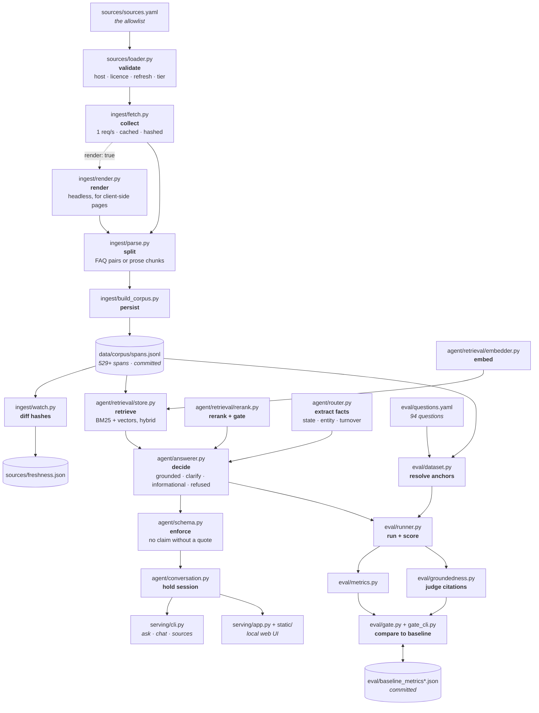

# How it works

*The stack, the state it keeps, and how the files fit together.*

[← back to the README](../README.md)

---

## Which AI framework is this built on?

None. That is a deliberate answer rather than an omission, so here is the whole
inventory.

**Not used, and not for lack of trying them first:**

| | Why not |
|---|---|
| LangChain / LlamaIndex / Haystack | The pipeline is retrieve → gate → quote. Four files, no chains, no agents. A framework here would add indirection over roughly 300 lines of logic and hide the two places that matter — the grounding validator and the refusal gate |
| A vector database (Pinecone, Weaviate, pgvector, Chroma) | Measured: 692 spans is a 1 MB matrix and exact search takes 0.38 ms. A network round trip to a hosted index costs 20–50 ms *before* doing any work, and an HNSW index would be approximate where this is exact |
| An LLM API (OpenAI, Anthropic, Gemini) | Nothing generates text. Adding one would make fabrication possible for the first time, and end the $0 evaluation that lets the gate run on every pull request |
| An embedding API | The embedding model runs locally. Nothing about a question leaves the machine |

**Actually used:**

| | What for |
|---|---|
| **BM25** | Lexical retrieval. Hand-written in [`agent/retrieval/store.py`](../agent/retrieval/store.py) — an inverted index and about forty lines of arithmetic |
| **`BAAI/bge-small-en-v1.5`** | Semantic retrieval. Local, ~130 MB, optional; falls back to character n-gram hashing |
| **`BAAI/bge-reranker-base`** | Reranking *and* the refusal gate — the same score does both. Local, optional |
| **`sentence-transformers`** | Loads and runs both of the above. The only ML dependency, and it is an optional extra |
| **Pydantic** | The output contract. This is where "no claim without a quote" is enforced |
| **FastAPI** | Serving |
| **numpy** | The vector matrix |

Both models are **encoders**: they score and rank text, they never write it. So
the honest one-line answer to "which AI is in it" is *two small ranking models,
both optional, both local, and no generative model at all.*

## What AI is in the backend?

**None, by default.** No language model is called, no API key is needed, and
nothing leaves your machine except the requests that fetch the government pages
themselves. The only outbound calls anywhere in the package are in
`ingest/fetch.py`.

| stage | what actually runs |
|---|---|
| lexical retrieval | **BM25** — a ranking function from 1994. Arithmetic over term frequencies. |
| semantic retrieval | **`BAAI/bge-small-en-v1.5`** when the extra is installed, otherwise character n-gram hashing. Local, offline, no key. Finds spans; writes nothing. |
| answering | **Extractive.** The answer *is* the source's sentences, returned verbatim. There is no generation step. |
| reranking *(optional)* | **`BAAI/bge-reranker-base`**, a local cross-encoder. Runs on your CPU, only *reorders* candidates, and gates refusals — it never writes text. |

The two models are both *encoders*: they score and rank text, they do not
generate it. That is a design choice, not a limitation waiting to be fixed. Fabrication is
impossible here by construction rather than by prompt: there is no step at which
a sentence could acquire a fact the corpus does not contain. It also means the
whole evaluation runs for `$0.0000` with no key, which is why the CI gate can
afford to check every pull request.

`agent/llm.py` defines a `StructuredModel` protocol for optionally synthesising
several quotes into connected prose. It is **imported by nothing** — not the
answerer, not the evaluation, not the service — and has never been run against a
live model. If it is ever wired up, the groundedness judge and its zero-tolerance
fabrication gate are already in place to police it.

---

## What is remembered, and where

Seven kinds of state, with deliberately different lifetimes. The short version:
**nothing about the person asking is ever written to disk.**

| Stage | What is held | Where | Lifetime | Committed? |
|---|---|---|---|---|
| Fetch | Raw extracted text per source, plus status and fetch time | `data/raw/<id>.txt` + `.json` | Until `--refresh` | No — regenerable |
| Build | Parsed spans: text, citation, tier, dates, state scope, content hash | `data/corpus/spans.jsonl` | Until rebuilt | **Yes** — CI needs it |
| Embed | The corpus vector matrix | `data/corpus/vectors/<fingerprint>.npy` | Until model or corpus changes | No |
| Serve | BM25 postings + vector matrix + allowlist | Process memory | Process | — |
| Converse | The asker's state, entity type, and one held question | Process memory, per session id | Process | **Never** |
| Watch | Per-source content hash and verdict | `sources/freshness.json` | Until next watch run | Yes |
| Gate | What "good" looked like last time | `eval/baseline_metrics*.json` | Until deliberately updated | **Yes** |

Four of these are worth explaining.

**The vector cache is keyed on the model *and* a fingerprint of the span ids.**
Swap the embedder or rebuild the corpus and the key changes, so stale vectors
for text that no longer exists can never be served. It is gitignored because it
is derived and large; the corpus it comes from is committed instead.

**The corpus is committed and the raw text is not.** That is what lets the CI
gate run with no network and no credentials — the thing being measured travels
with the repository, while the 400 KB of fetched pages it came from does not.

**Session memory is per-process and never persisted.** A conversation holds only
what the founder said about their own company — a state code, an entity type —
and it dies with the server. This is meant to run locally, so writing that to
disk would create a small store of someone's business details in exchange for
nothing they asked for.

**The baselines are the project's memory of its own quality.** They are the only
state here that exists to be compared against rather than read: without a
committed record of what the numbers were, "did this change make it worse" is
only answerable on the laptop of whoever asks.

## How the pieces connect

Three paths through the code. They share the corpus and nothing else — which is
why the evaluation can run with no network and the service with no evaluation.



### What each file takes, does, and returns

| File | In | Action | Out |
|---|---|---|---|
| `sources/loader.py` | `sources.yaml` | Reject any source that is off an official host without a declared reason, or missing a licence or refresh window | Validated `Allowlist` |
| `ingest/fetch.py` | Allowlist entry | GET at 1 req/s, cache, hash the readable text | `FetchResult` + `data/raw/` |
| `ingest/render.py` | URL + CSS selector | Run the page's own JavaScript; never used on a host that refused us | Rendered text |
| `ingest/parse.py` | Fetched text | Pair Q&A, or chunk prose; drop navigation chrome | `SourceSpan[]` |
| `ingest/build_corpus.py` | Allowlist + fetches | Deduplicate by content hash, persist, report coverage | `spans.jsonl` |
| `ingest/watch.py` | Corpus + live sources | Re-fetch and diff content hashes | `freshness.json` |
| `agent/retrieval/embedder.py` | Text | Embed (model, or hashing fallback) | Normalised vectors |
| `agent/retrieval/store.py` | Spans + vectors | Hybrid BM25 + cosine, filtered before scoring | Ranked `ScoredSpan[]` |
| `agent/retrieval/rerank.py` | Question + candidates | Score jointly; the score also gates refusals | Reordered hits |
| `agent/router.py` | Question | Extract state, entity, turnover — **null rather than guess** | `Routing` |
| `agent/answerer.py` | Question + routing | Choose one of four outcomes; require a state-scoped span for state law | `Answer` |
| `agent/schema.py` | Claims + citations | Refuse to construct a claim with no quote; stamp the disclaimer | Validated `Answer` |
| `agent/conversation.py` | Message + session | Hold a clarifying question; carry stated facts forward | `Turn` |
| `serving/cli.py` | Argv | Render plates as text; warn on external or stale sources | stdout |
| `serving/app.py` | HTTP | Serve `/chat`, `/ask`, `/sources`; sessions in memory only | JSON + the web UI |
| `eval/dataset.py` | `questions.yaml` + corpus | Resolve each gold label by content anchor; fail loudly if ambiguous | `Example[]` |
| `eval/runner.py` | Examples + answerer | Run every question, record retrieval and routing | `EvalReport` |
| `eval/groundedness.py` | Answer + retrieved | Structural verdicts: fabricated, unofficial, stale, external | `GroundednessReport` |
| `eval/gate.py` | Current + baseline | Fail on regression; fail on *increase* for the three inverted metrics | Exit code |

## Layout

```
sources/     the allowlist and its validator - the only path into the index
ingest/      fetch, parse, persist, and the freshness watcher
agent/       router, answerer, output contract
agent/retrieval/  hybrid store, hashing embedder, reranker protocol
eval/        question set, metrics, groundedness judge, CI gate
serving/     CLI, chat REPL, FastAPI service, and the web UI
```

Design decisions for the web UI live in [DESIGN.md](DESIGN.md); durable product
truth in [PRODUCT.md](PRODUCT.md).

---

[← back to the README](../README.md)
